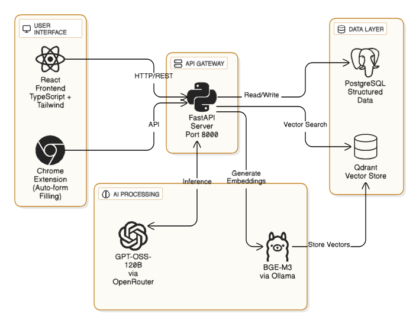

# Job Application AI Agent

AI-powered job application automation system that combines CV intelligence, job matching, and intelligent form filling.

**📖 Full setup guide:** [docs/SETUP.md](docs/SETUP.md)
**📖 Extension docs:** [extension/README.md](extension/README.md)

---

## What it does

- **CV intelligence** – Parses resumes, extracts structured data, and generates tailored versions of resumes and cover letter for specific jobs
- **Job matching** – Vector similarity search (Qdrant) + LLM scoring to find relevant opportunities
- **Interview prep** – Question banks, practice sessions, and performance analytics
- **Smart form filling** – A Chrome extension that understands modern HTML job application forms using LLM-based semantic extraction instead of fragile CSS selectors

---

## Tech stack

**Backend:** FastAPI · PostgreSQL · Qdrant · OpenRouter · Ollama  
**Frontend:** React · TypeScript · Vite · Tailwind CSS  
**Extension:** Chrome Manifest V3

---

## Quick start

```bash
# 1. Frontend
npm install
npm run dev               # Runs on http://localhost:5173

# 2. Backend
cd backend
python -m venv venv
source venv/bin/activate  # Windows: .\venv\Scripts\Activate.ps1
pip install -r requirements.txt
cp .env.example .env      # Edit with your credentials
python main.py            # Runs on http://localhost:8000

# 3. Extension (optional steps to create icons for the extension)
cd extension
pip install Pillow 
python create-icons.py
# Load unpacked in chrome://extensions/
```

**Prerequisites:** PostgreSQL 15+, Node.js 18+, Python 3.9+, Ollama (for embeddings)

See [docs/SETUP.md](docs/SETUP.md) for detailed instructions including database setup, environment variables, and troubleshooting.

---

## Project structure

```
backend/         FastAPI API, services, migrations
src/             React frontend (dashboard, CV tools)
extension/       Chrome extension (auto-fill runtime)
docs/            Setup guide, architecture notes, infra examples
```

---

## How the auto-fill works

1. User logs into the web app and uploads their CV
2. Extension injects an "AI Auto-Fill" button on the bottom right corner of job application pages
3. When clicked, it extracts form elements using the Accessibility API 
4. Element metadata → backend → LLM analyzes and matches CV data to fields
5. Extension fills the form with high-confidence values, highlights medium-confidence fields, and prompts for low-confidence ones

Works across diverse form implementations because it understands semantic roles (`textbox`, `combobox`, `radio`) rather than relying on specific HTML structures.

---

## Security notes

- **Never commit** API keys or credentials – they belong in `.env` (already gitignored)
- **Generate fresh secrets** before deployment: `openssl rand -hex 32`
- **Rotate keys immediately** if you suspect a leak
- Run a secret scanner like `gitleaks` before publishing

---

## License

MIT © 2025
